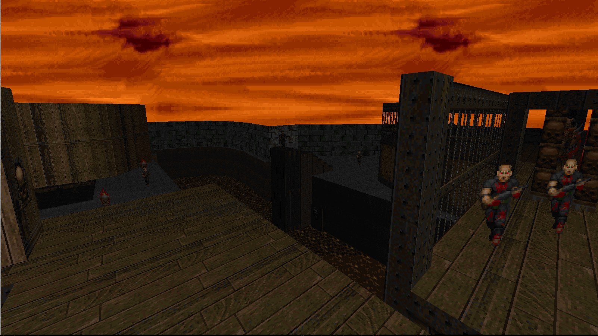

[](https://travis-ci.org/cristicbz/rust-doom)

Rust Doom
=========

A little Doom 1 & 2 Renderer written in [Rust](https://github.com/rust-lang/rust). Mostly written while I was learning the language about 2 years ago, so it might not the best example of Rust code! PR-s are welcome.

The code is mostly based on the endlessly useful [Doom Wiki](http://doomwiki.org) and the [Unofficial Doom Specs](http://www.gamers.org/dhs/helpdocs/dmsp1666.html). It is **not** a port of the original Doom C source code into Rust; I've been doing my best to make the code as idiomatic as possible and have not looked at the original in a long time.

*Note: You need a WAD file to try this. Get a [shareware one](http://www.pc-freak.net/files/doom-wad-files/Doom1.WAD) if you don't own the game.*

## Screenshots



### Build Instructions
Rust Doom should always build on the latest stable version of Rust (but is also tested on beta and nightly), which you can install using any of the methods described on [the Rust website](https://www.rust-lang.org/downloads.html).

To build, run [cargo](http://crates.io) in the project's root (where Cargo.toml is):
```
cargo build --release
```

Note that you'll need a WAD file (which contains the game's levels and art assets). If you own the game (or are willing to buy it for a few quid/bucks), you'll find the WAD in your game folder. If not, you can use the [shareware ones](http://distro.ibiblio.org/pub/linux/distributions/slitaz/sources/packages/d/doom1.wad) floating around on the interwebs. Or, though I would not know of such things, you may be able to obtain the originals for free in less.... savoury parts of the internet.

Copy the WAD file to the repo root (where Cargo.toml is). Then, to run:
```
target/release/rs_doom --iwad your_wad_file.wad
```

Without any flags it will try to load the first level of 'doom1.wad'. You can
specify which level to load, FOV and resolution preferences using the flags. Run
with '-h' for a list of options.

## Goals
_(subject to change)_

* **Modern OpenGL 3+ renderer.** No immediate mode shenanigans: it's all VBO-s and shaders. Unlike some GL ports, the floors are actually rendered as convex polygons computed from the BSP. The downside of this (or upside depending on your perspective) is that some visual glitches (like [slime trails](http://doom.wikia.com/wiki/Slime_trail)) don't show up.
* **Correct 256 color palette.** Uses the original palette and colormaps to replicate the original lighting effects (mostly you'll notice things get darker in visible steps and they also get greyer as they get darker). Doing 256 color palette lookups in a fragment shader is wonderfully anachronistic.
* **Free flying camera.** Mouse & keyboard control for full 6 degrees of freedom.
* **100% safe code.** No pesky `unsafe` blocks anywhere.

## Todo
* [x] BSP -> convex subsector conversion.
* [x] Flats (floors & ceiling) texture mapping.
* [x] Wall texture mapping.
* [x] Wall texture alignment.
* [x] Scrolling walls.
* [x] Animated flats.
* [x] Animated walls.
* [x] Lighting effects (flickering, flashing, glow etc.)
* [x] Sky rendering.
* [x] Sprite rendering.
* [x] Correct player movement (falling etc.)
* [x] Player-flat collisions.
* [x] Player-wall collisions.
* [ ] Sprite-player and sprite-sprite collisions.
* [ ] Sprite animations.
* [ ] BSP frustum culling.
